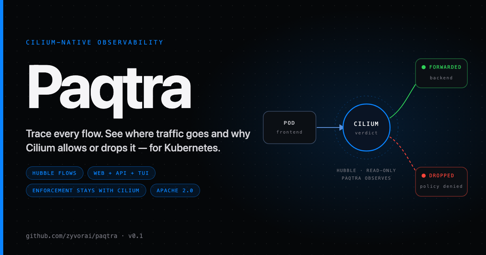
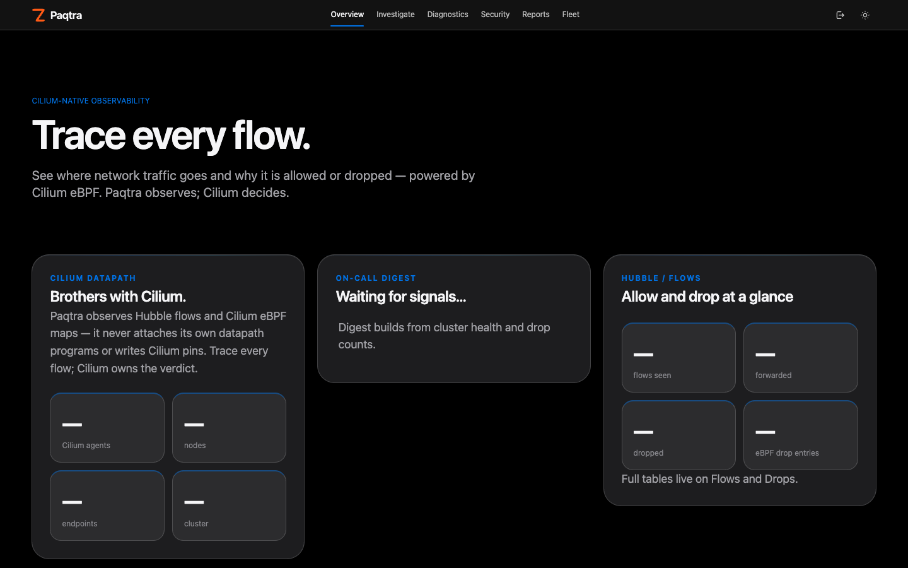
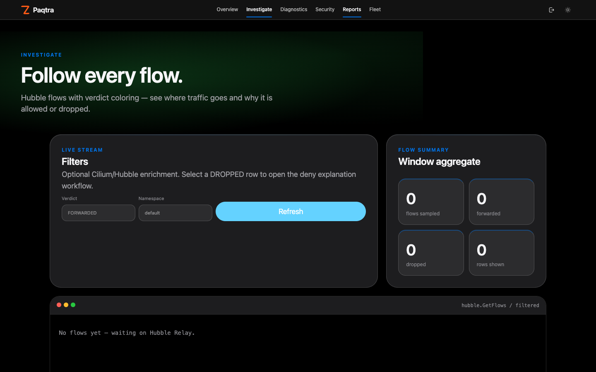
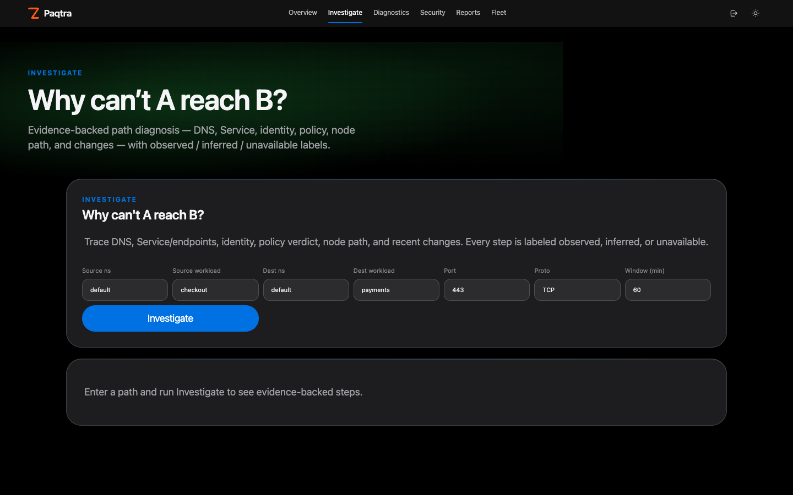
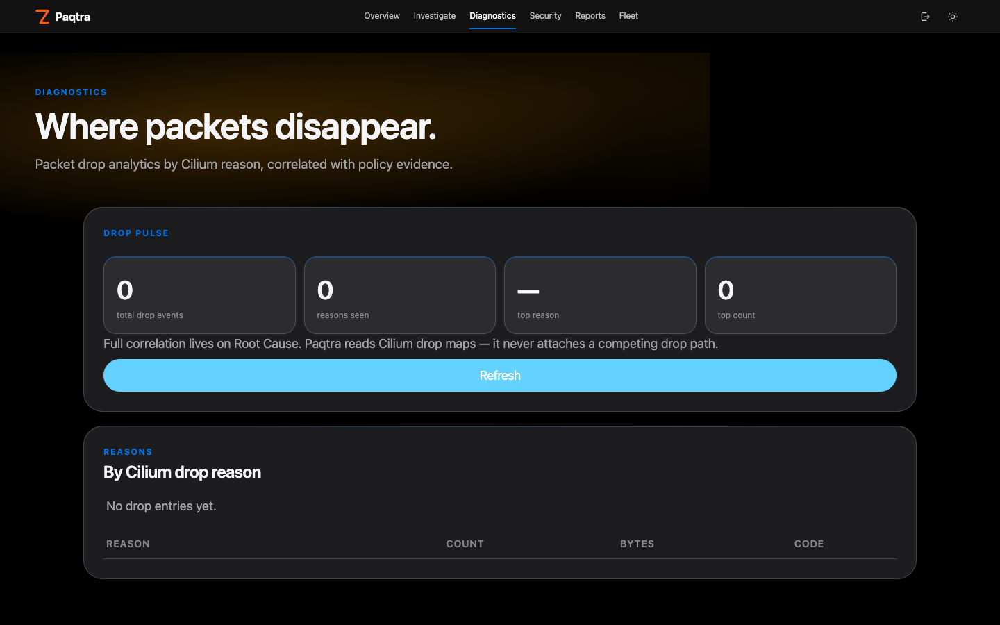
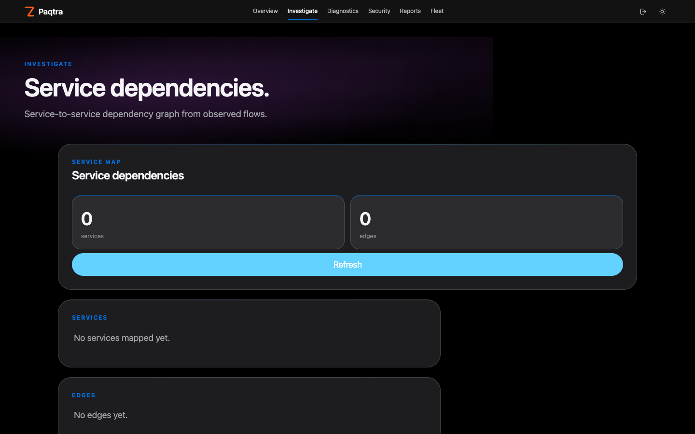
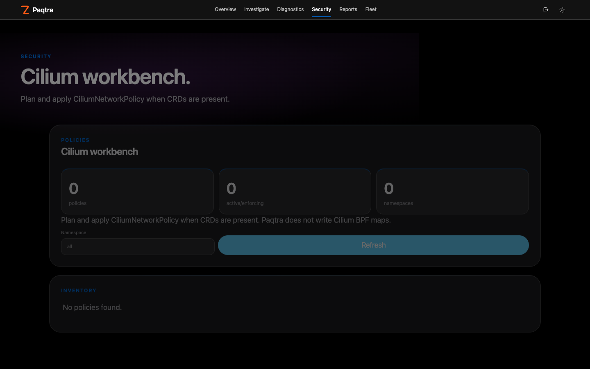
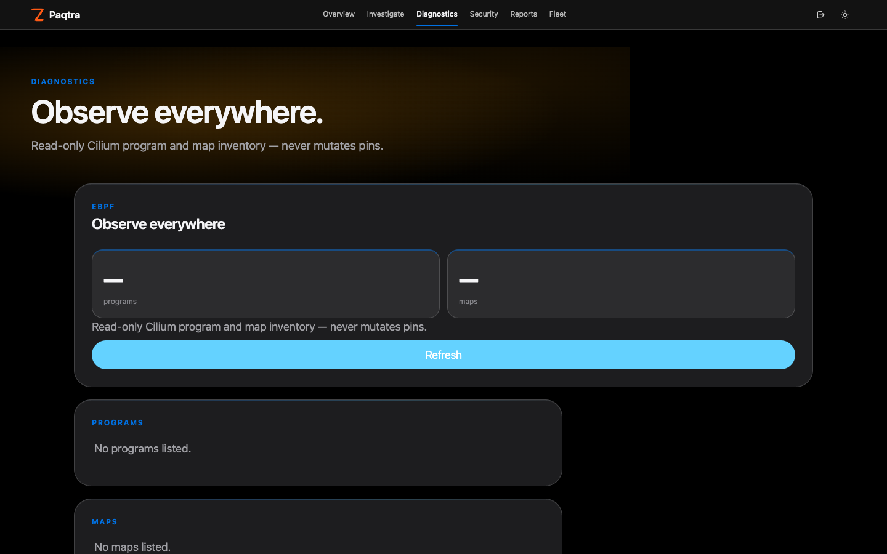
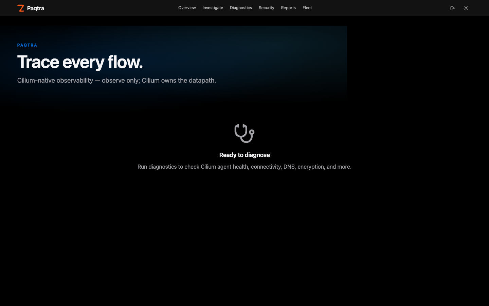
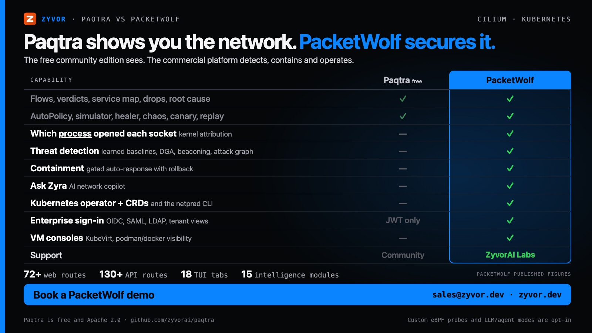

# Paqtra

[](https://github.com/zyvorai/paqtra/actions/workflows/ci.yml)
[](LICENSE)
[](https://cilium.io/)
[](CHANGELOG.md)



**Cilium-native network observability and operations for Kubernetes — trace every flow.**

📖 **[Read the full docs](https://zyvorai.github.io/paqtra/)** — quickstart, architecture, the Cilium boundary, and a product tour.

See where network traffic goes and why it is allowed or dropped. Paqtra ships a web dashboard, a REST API and a terminal TUI in one deployable package. Flows come from Hubble; node-local enrichment may read the BPF map inventory. Enforcement stays with Cilium: policy changes go through `CiliumNetworkPolicy` (CNP), never through Paqtra's own datapath.

Paqtra is the free, Apache-2.0 community edition of **PacketWolf**, Zyvor's commercial Cilium platform. See [Paqtra vs PacketWolf](#paqtra-vs-packetwolf) for what the paid edition adds.

Paqtra is observe-first and **read-only toward the datapath**. It never writes Cilium BPF maps, never attaches, detaches or replaces Cilium (or Netra) programs, and is not a second CNI. See [What Paqtra never does](#what-paqtra-never-does).

## Contents

- [Dashboard gallery](#dashboard-gallery)
- [What it does](#what-it-does)
- [What Paqtra never does](#what-paqtra-never-does)
- [Paqtra vs PacketWolf](#paqtra-vs-packetwolf)
- [Suite placement (Cilium, Paqtra, Netra)](#suite-placement-cilium-paqtra-netra)
- [Architecture](#architecture)
- [Web dashboard](#web-dashboard)
- [REST API](#rest-api)
- [Terminal TUI](#terminal-tui)
- [Repository](#repository)
- [Quick start](#quick-start)
- [Deployment options](#deployment-options)
- [Testing](#testing)
- [Security](#security)
- [Requirements](#requirements)
- [License](#license)



## Dashboard gallery

Captured against a live lab cluster with Cilium and Hubble. Full tour on the [docs site gallery](https://zyvorai.github.io/paqtra/gallery/).
















## What it does

| Area | Capabilities |
|------|-------------|
| **Flow monitoring** | Live Hubble Observer gRPC follow-stream into a local flow store, verdict coloring, WebSocket streaming, ingest gap visibility on `/health` |
| **Investigation** | Path explain (`POST /investigate/path`), **Why denied?** from a selected flow (`POST /investigate/flow`), confidence-tagged evidence |
| **DNS** | Real L7 DNS query/rcode/answers/latency when Cilium DNS visibility is on; L4-only never invents SERVFAIL |
| **Policy management** | Visual rule builder, YAML editor, ML-powered AutoPolicy, evidence-backed simulate before applying |
| **Security** | Zero-trust policy generation, compliance audits (CIS/NIST/SOC2), anomaly detection |
| **Root cause** | Packet drop analysis, policy correlation, one-click fixes, network healer |
| **Chaos engineering** | Fault injection (loss/latency/DNS), circuit breaker, preset experiments |
| **Canary deployments** | Progressive traffic shifting, health gates, auto-promote/rollback |
| **Multi-cluster** | Cluster registration, health checks, policy sync, topology view |
| **Networking** | Load balancer, ingress/egress, IPAM, encryption, BGP, ClusterMesh, WireGuard |
| **Observability** | Service map, heatmap, DNS monitor, latency analysis, bandwidth, cost analytics |
| **Operations** | Diagnostics, troubleshooter, packet capture sessions, SLOs, alerts, audit log, incidents |

The dashboard includes real kernel eBPF data views powered by `bpftool`: conntrack tables, policy maps, IP cache, LB maps and drop analytics. These are read-only; see [docs/ebpf-integration.md](docs/ebpf-integration.md).

## What Paqtra never does

These are hard boundaries, enforced by review and repeated in [AGENTS.md](AGENTS.md):

- Never writes Cilium BPF maps or pins over `cil_*` programs.
- Never attaches, detaches or replaces Cilium (or Netra) programs. Attachment inventory is **read-only** classification (`cil_*` / `netra_*` / other).
- The agent observes, reports health and inventories. Policy apply goes through Cilium CRDs.
- Does not collect application payloads, argv/cmdline, or Secret contents.
- Does not introduce a second CNI or compete with Cilium's datapath.
- Prefers Hubble for flows; uses maps for node-local enrichment only.

Details: [docs/cilium-brotherhood.md](docs/cilium-brotherhood.md) and [docs/ebpf-integration.md](docs/ebpf-integration.md).

## Paqtra vs PacketWolf



Paqtra is the free community edition. **PacketWolf** is the commercial platform on the same Cilium-native foundation, for teams that need to go from *seeing* the network to *securing and operating* it.

| | **Paqtra** (Apache 2.0) | **PacketWolf** (commercial) |
|---|---|---|
| Flows, verdicts, service map, drops, root cause | ✅ | ✅ |
| AutoPolicy, simulator, healer, chaos, canary, replay, multi-cluster | ✅ | ✅ |
| Which **process** opened each socket (kernel attribution, syscall tracing, `netpred explain`) | — | ✅ |
| Custom eBPF probes with honest attach status | — (read-only by design) | ✅ opt-in |
| **Threat detection**: learned baselines, DGA and beaconing, attack graph, GeoThreat, Tetragon correlation | — | ✅ |
| **Containment**: six profiles, gated auto-response with rollback, forensic pack | — | ✅ |
| Zero-Trust Pilot, policy insight scorecard, blast radius, drift scan, KubePosture | — | ✅ |
| **Ask Zyra** network copilot (58 read-only tools, gated write actions) | — | ✅ |
| Compliance Lens (SOC 2, PCI-DSS, HIPAA), CVE posture, cost-aware egress, risk forecast | Basic audits (CIS, NIST, SOC 2) | ✅ |
| Kubernetes operator and CRDs, `netpred` CLI | — | ✅ |
| OIDC, SAML, LDAP sign-in, tenant views, SIEM export | JWT | ✅ |
| KubeVirt VM console and VNC, in-browser shell, podman/docker visibility | — | ✅ |
| Support | Community | ZyvorAI Labs |

The full breakdown is in [docs/paqtra-vs-packetwolf.md](docs/paqtra-vs-packetwolf.md). For a demo, a trial or pricing, contact [sales@zyvor.dev](mailto:sales@zyvor.dev) or visit [zyvor.dev](https://zyvor.dev).

## Suite placement (Cilium, Paqtra, Netra)

Paqtra is the **Cilium-native** observe/ops sibling. **Netra** is the independent eBPF sibling (own programs and maps under `/sys/fs/bpf/netra`, leased emergency control). They must not fight.

| Role | Owns | Must not |
|------|------|----------|
| **PacketWolf** | Commercial superset of Paqtra: kernel attribution, threat detection, containment, operator | See its own license and docs |
| **Cilium** | CNI, policy maps, identity, datapath (`cil_*`) | — |
| **Paqtra** | Hubble/API/UI, install/status CLI, **read-only** map + program inventory | Write Cilium maps; attach/replace Cilium programs; second CNI |
| **Netra** | Own programs under `/sys/fs/bpf/netra`, TCX/XDP, netlink | Modify Cilium maps |

| Choose **Paqtra** when… | Choose **Netra** when… |
| --- | --- |
| Cilium is already the CNI of record | You need CNI-independent observe on cgroup v2 alone |
| You want Hubble flows, path investigation and policy preview in one place | You want a leased emergency deny with automatic return to observe |
| Policy changes should stay in Cilium CNPs | You need kernel drop attribution and packet capture without a CNI |

Full rules: [docs/cilium-brotherhood.md](docs/cilium-brotherhood.md). Agent instructions: [AGENTS.md](AGENTS.md).

## Architecture

```
+------------------------------------------------------------------+
|                    Web Dashboard (React 19 + TypeScript)           |
|  60+ pages | WebSocket | Dark/Light theme                          |
+------------------------------------------------------------------+
|                    REST API (Rust + Axum)                          |
|  OpenAPI-documented | JWT auth | Redis cache | Rate limiting       |
+------------------------------------------------------------------+
|                    Terminal TUI (Rust + Ratatui)                   |
|  13 tabs | Live monitoring | Packet explainer                      |
+------------------------------------------------------------------+
|  eBPF maps (read-only) | Hubble gRPC (Relay) | Kubernetes API | Redis |
+------------------------------------------------------------------+
|  bpftool (read-only kernel data: conntrack, policy, IP cache, LB)  |
+------------------------------------------------------------------+
|              Cilium agent  |  Linux kernel eBPF datapath           |
+------------------------------------------------------------------+
```

See [docs/architecture.md](docs/architecture.md) and [docs/web-architecture.md](docs/web-architecture.md).

## Web dashboard

60+ pages, grouped in the navigation as Overview · Investigate · Diagnostics · Security · Reports · Fleet. The routes and their descriptions live in [`web-ui/src/navConfig.ts`](web-ui/src/navConfig.ts).

- **Investigate**: Path ("why can't A reach B?"), Flows (**Why denied?** on DROPPED rows), Endpoints, Identities, DNS (L7 when available), Capture, Topology, Service Map
- **Diagnostics**: Health (Hubble mode, ingest gaps/lag), latency, Drops, eBPF profiler and map explorer, Root Cause, Healer
- **Security**: Policies, Policy Rules (add/edit/delete single rules), Policy Editor, Visual Rule Builder, Templates, Anomalies, Compliance, RBAC
- **Intelligence**: AutoPolicy, Chaos Engineering, Canary Deployments
- **Operations**: Alerts, Audit Log, SLOs, Incident Timeline, Settings
- **Networking**: ClusterMesh, BGP, Load Balancer, Ingress/Egress Gateway, IPAM, Encryption, WireGuard

Every view has auto-refresh (30 s, with a toggle), a data-freshness indicator, CSV/JSON export, empty-state messaging and error handling with retry.

### Policy management

| Feature | How |
|---------|-----|
| **Create (YAML)** | Monaco editor with syntax highlighting and validation |
| **Create (Visual)** | Form-based rule builder with live YAML preview |
| **Create (Template)** | Pre-built policy templates library |
| **Create (ML)** | AutoPolicy engine learns traffic and generates policies |
| **Edit / update** | Click the pencil icon, modify, apply |
| **Delete** | Single or bulk (multi-select checkboxes) |
| **Simulate** | Dry-run impact analysis before applying |
| **Validate** | Schema validation with error details |

Policies are applied as `CiliumNetworkPolicy` objects through the Kubernetes API. Cilium enforces them.

## REST API

The REST API serves JSON over HTTP with JWT authentication and is documented in [docs/openapi.yaml](docs/openapi.yaml). It includes eBPF endpoints that read kernel data through `bpftool`.

```bash
# Health check
curl http://localhost:9191/health

# List flows
curl http://localhost:9191/api/v1/flows

# List policies
curl http://localhost:9191/api/v1/policies

# Generate policy from traffic
curl -X POST http://localhost:9191/api/v1/modules/autopolicy/generate \
  -H 'Content-Type: application/json' \
  -d '{"namespace":"default","observation_duration":"5m"}'
```

Full endpoint list: [docs/web-architecture.md](docs/web-architecture.md) and [docs/client/api-reference.html](docs/client/api-reference.html).

| Interface | URL |
|-----------|-----|
| Web dashboard | `http://<host>:9191` |
| REST API | `http://<host>:9191/api/v1/` |
| WebSocket | `ws://<host>:9191/api/v1/ws/metrics` |
| Health check | `http://<host>:9191/health` |

## Terminal TUI

13 interactive tabs with vim-style navigation: Flows, Connections, Endpoints, Policies, Metrics, Healer, AutoPolicy, RootCause, Simulator, Replay, Chaos, Canary and MultiCluster.

| Key | Action |
|-----|--------|
| `Tab` / `Shift+Tab` | Cycle tabs |
| `?` | Help overlay |
| `q` | Quit |
| `e` | Explain selected packet |
| `d` | Detect problems (Healer) |
| `s` | Simulate / Stop |
| `t` | Enter time-travel mode |

## Repository

| Path | Description |
|------|-------------|
| [QUICKSTART.md](QUICKSTART.md) | Install and smoke paths |
| [docs/overview.md](docs/overview.md) | Product overview |
| [docs/features.md](docs/features.md) | Feature / TUI catalog |
| [docs/architecture.md](docs/architecture.md) | System architecture |
| [docs/web-app.md](docs/web-app.md) | Web UI stack |
| [docs/web-architecture.md](docs/web-architecture.md) | API + UI architecture |
| [docs/web-deployment.md](docs/web-deployment.md) | Deploy options |
| [docs/cilium-brotherhood.md](docs/cilium-brotherhood.md) | Cilium / Netra boundaries |
| [docs/paqtra-vs-packetwolf.md](docs/paqtra-vs-packetwolf.md) | Community vs commercial edition |
| [docs/investigate.md](docs/investigate.md) | Path investigation + policy preview |
| [docs/autopolicy.md](docs/autopolicy.md) | AutoPolicy guide |
| [docs/simulator.md](docs/simulator.md) | Policy simulator |
| [docs/replay.md](docs/replay.md) | Flow replay |
| [docs/rootcause.md](docs/rootcause.md) | Root-cause analysis |
| [docs/ebpf-integration.md](docs/ebpf-integration.md) | eBPF integration |
| [docs/tui.md](docs/tui.md) | TUI integration |
| [docs/auto-install.md](docs/auto-install.md) | Auto-install |
| [docs/autopolicy-quickstart.md](docs/autopolicy-quickstart.md) | AutoPolicy quick start |
| [docs/client/](docs/client/) | Client HTML (API ref, security whitepaper, …) |
| [docs/social/](docs/social/) | Social cards and how to rebuild them |
| [website/](website/) | Docusaurus docs site (GitHub Pages) |
| [SECURITY.md](SECURITY.md) | Vulnerability reporting |
| [CODE_OF_CONDUCT.md](CODE_OF_CONDUCT.md) | Community standards |
| [CHANGELOG.md](CHANGELOG.md) | Release notes |
| [CONTRIBUTING.md](CONTRIBUTING.md) | Contribution guide |
| [AGENTS.md](AGENTS.md) | Coding-agent boundaries |
| [NOTICE](NOTICE) | Apache attribution |

## Quick start

Prerequisites: a Kubernetes cluster with Cilium and Hubble enabled, `kubectl` configured, and Rust and Node.js to build from source (see [Requirements](#requirements)).

```bash
git clone https://github.com/zyvorai/paqtra.git
cd paqtra

# Build everything
cargo build --release                    # TUI binary
cd web-api && cargo build --release      # API server
cd ../web-ui && npm ci && npm run build  # Web dashboard

# Run the TUI
./target/release/paqtra                  # or: paqtra --skip-bootstrap

# Or deploy to a remote K3s cluster
./scripts/deploy-k3s-test.sh <host> <user> <password> --test
```

See [QUICKSTART.md](QUICKSTART.md) for the Docker Compose and manual web-stack paths.

## Deployment options

| Method | Command |
|--------|---------|
| **Remote K3s** | `./scripts/deploy-k3s-test.sh <host> <user> <pass> --test` |
| **Docker** | `docker compose -f deployments/docker-compose.yaml up` |
| **Helm** | `helm install paqtra ./chart` |
| **Systemd** | `bash install.sh setup-services && bash install.sh start` |
| **Binary** | `cargo build --release && cp target/release/paqtra /usr/local/bin/` |

### Environment variables

```bash
PAQTRA_HOST=0.0.0.0        # API listen address
PAQTRA_PORT=9191           # API port
JWT_SECRET=<min-32-chars>  # Required for auth
ADMIN_PASSWORD=<min-12>    # Required when auth is enabled
ADMIN_USERNAME=admin       # Optional (default: admin)
HUBBLE_ADDRESS=localhost:4245
UI_DIST_DIR=/var/lib/paqtra/ui  # Path to built web UI
AUTH_DISABLED=true         # Dev mode only (requires ENVIRONMENT=development|test)
```

## Testing

Run the same gates contributors use before a PR:

```bash
make check-all
make test-all
make build-all
```

CI also exercises the chart, CLI and remote smoke scripts under `scripts/ci-*.sh` when those jobs are enabled. Individual suites: `cargo test`, `cd web-api && cargo test`, `cd web-ui && npm test`.

## Security

- JWT authentication (HS256, 32+ char secret); no default credentials, `ADMIN_PASSWORD` is required when auth is enabled
- RBAC-ready middleware
- Input validation on all kubectl-bound fields
- CORS with an explicit origin allowlist
- Rate limiting
- Confirmation dialogs on destructive operations
- Secure temp files via `tempfile::NamedTempFile`

Report vulnerabilities through [SECURITY.md](SECURITY.md). Deeper reading: [docs/client/security-whitepaper.html](docs/client/security-whitepaper.html).

## Requirements

| Component | Minimum | Recommended |
|-----------|---------|-------------|
| Rust | 1.75 | latest stable |
| Node.js | 18 | 22+ |
| Kubernetes | 1.25 | 1.28+ |
| Cilium | 1.14 | 1.19+ |
| Redis | 6.0 | 7.0+ |

## License

Licensed under the **[Apache License 2.0](LICENSE)**. Contributions are accepted under the same license. See [NOTICE](NOTICE).

## Acknowledgments

- [Cilium](https://cilium.io/) - eBPF-based networking
- [Hubble](https://docs.cilium.io/en/stable/observability/hubble/) - Network observability
- [Ratatui](https://ratatui.rs/) - Terminal UI framework
- [Axum](https://github.com/tokio-rs/axum) - Rust web framework
- [React](https://react.dev/) - UI framework
- [Tailwind CSS](https://tailwindcss.com/) - Utility-first CSS
